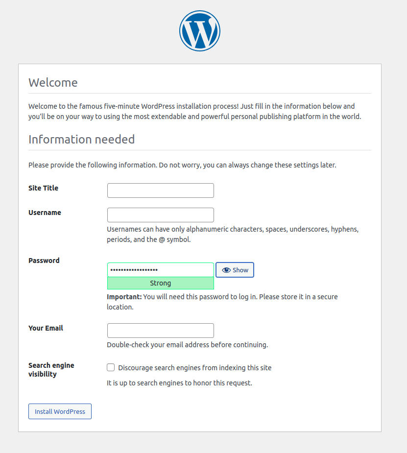

# Quickstart: Bashpress
You can use Docker Compose to easily run a Wordpress in an isolated environment built with Docker containers. This quick-start guide demonstrates how to set up and run the script.

## Build the site

> **Note:** This script has been tested to work on Ubuntu 22.04 and it should work on debian based systems.

To start the container/site
```bash
$ git clone https://github.com/riskarsh/bashpress.git
$ cd bashpress
$ ./script.sh start
```
Provide the site name in the prompt


## Bring up WordPress in a web Browser

At this point, WordPress should be running on port 80 of your Host, and you can complete the "famous five-minute installation" as a WordPress administrator.

> **Note:** The WordPress site is not immediately available on port 80 because the containers are still being initialized and may take a couple of minutes before the first load.

 You can use `http://localhost` or the `http://<sitename>` that you have entered prior and open in a web browser.




## Shutdown and cleanup

To stop the container/site
```bash
$ ./script.sh stop
```

To delete the container/site
```bash
$ ./script.sh delete
```